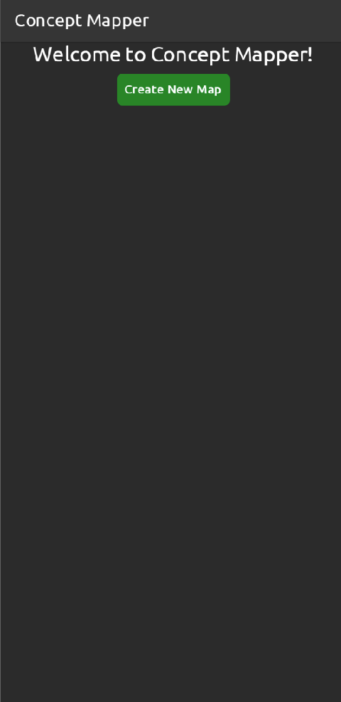

# Concept Mapper
Finally, I found the perfect project idea to explore the new shiny cross platform framework "Flutter".

It took me less than a week to get to this state of this project (23 commits).
It is working, but alsu very far to be perfect.

I liked Flutter's idea, and it seem to work very smoothly, indeed across any platform.

Thank you Google...

## Preview
I built a web version on [Heroku](https://dvirberlo-concepter.herokuapp.com/).

### Screenshots

